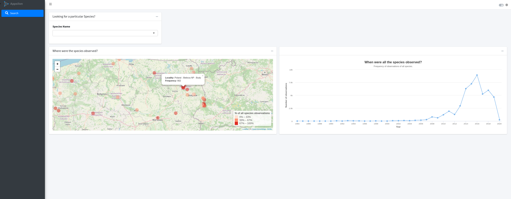
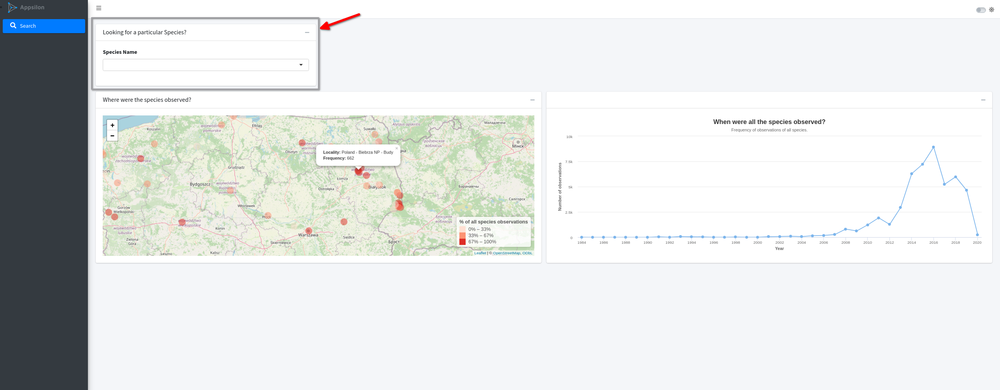
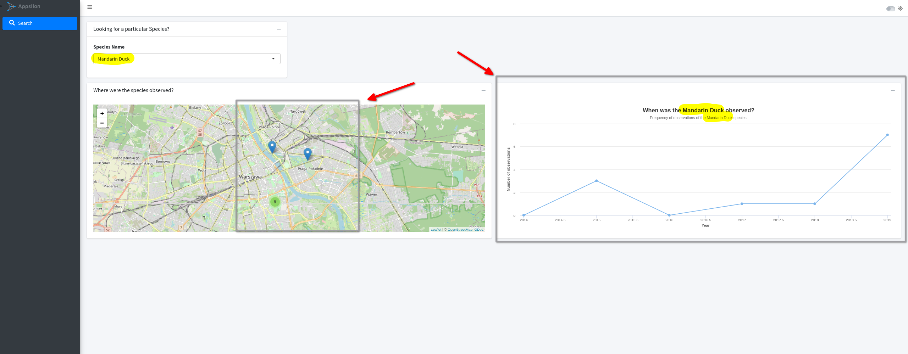
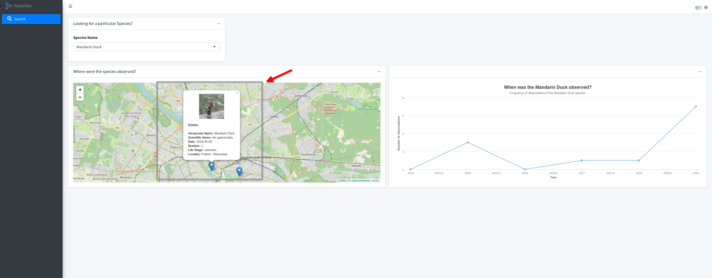

# @Appsilon Code Challenge




## Table of Content:
---
- [Overview](#overview)
- [User's Guide](#user-guide)
- [Developer's Guide](#developer-guide)
- [Author](#author)

## Overview <a name="overview"></a>
---

This is a Shiny app which allow users to visualize selected species on the map, as well as the timeline when the species were observed. This application was built using data from the [Global Biodiversity Information Facility](https://www.gbif.org/occurrence/search?dataset_key=8a863029-f435-446a-821e-275f4f641165), an international effort aimed at providing anyone, anywhere, open access to data about all types of life on Earth.

### Main tasks
        
- To visualize selected species observations on the map and how often it is observed;
- To view a visualization of a timeline when selected species were observed.	

## User's Guide <a name="user-guide"> </a>
---

Once the application starts, users visualize informations for all species observed in **Poland**. Specifically, I choose to demonstrate the frequency of observations of all species found in the country, as well as the frequency of these observation through the years. If the user click on the markers in the map, he will be able to see the locality, as well as the frequency of observation at that locality.



The user has the option to search for a specific species using the section called **Looking for a particualr Species?**. By clicking on the plus sign, the user can search for a specific species using the species' **vernacular name** or **scientific name**:



The application provides information about **where** the species were observed on the map and an interactive plot showing the **frequency** of observations through time. 
The map displays two kind of information:

1. It provides the location of each observation in the territory;
2. It provides the frequency of species in the territory by clustering the observations by area;

In addition, the user can inspect information about one specific observation by clicling on the markers on the map. A popup will open with details about the species observerd:




## Developer's Guide  <a name="developer-guide"> </a>
---

The application logic is very simple. The shiny apps are structured using modules. These modules are very useful to decompose independent functionalities and isolate the development of specific components of the app. The logic is as follows:

1. The user will provide a **species name** to the app (vernacular or scientific name);
2. **Species name** is then passed to a module called `speciesDataset`, which will filter the data and return the result to other modules in the application;
3. **Filtered data** and **species name** are passed to the modules responsible to create the map and timeline information;
4. Finally, the results are showed back to the user.

The following figure summarizes the application's flow:

[](https://mermaid-js.github.io/docs/mermaid-live-editor-beta/#/edit/eyJjb2RlIjoiZ3JhcGggVEJcbkFbVXNlcl0gLS0-fHNwZWNpZXMgbmFtZXwgQihzcGVjaWVzRGF0YXNldCBtb2R1bGUpXG5CIC0tPiAgQyhtYXBGcmVxdWVuY3kgbW9kdWxlKVxuQiAtLT4gIEQodGltZWxpbmUgbW9kdWxlKVxuQyAtLT4gRShpbmZvcm1hdGlvbiBtYXApXG5EIC0tPiBGKHRpbWVsaW5lIHBsb3QpXG5cblxuIiwibWVybWFpZCI6eyJ0aGVtZSI6ImRlZmF1bHQifSwidXBkYXRlRWRpdG9yIjpmYWxzZX0)

The app directory are organized according to the following structure:

```sh
├── app.R
├── /data
├── DESCRIPTION
├── /R
├── README.md
├── /tests
└── /www
```

The `/R` folder contains modules and scripts with utility functions, `/data` contains the datasets used, `/tests` folder contains the unit tests and `/www` have the elements that will be rendered in the web browser. 

The application are divided in three modules (`speciesDataset.R`, `mapFrequency.R`, `timeline.R`) and a script with utility functions (`utils.R`). The `app.R` is the main file which puts together all the components and starts the application. 

```sh
├── /R
├──── speciesDataset.R
├──── mapFrequency.R
├──── timeline.R
└──── utils.R
```

- `speciesDataset.R`: this module is responsible to retrieve the data from the biodiversity data and return the filtered dataset to the other modules in the application. 
- `mapFrequency.R`: this module contains to plot the map in order to visualize the selected species; 
- `timeline.R`: this module aimes to plot the timeline of the observations of the species through time. 
- `utils.R`: This is a script which contain all the non-reactive code bundled in functions to be used in the application. 

The `/test`directory, contains a **unit test** for the main function from my `utils.R` script, called `getSpecies`. This function is the workhorse of the application since it is responsible to query the data from the datasource parque file. In order to create and run the unit test, I use the [testthat package](https://testthat.r-lib.org/). 

```sh
├── /tests
├──── /testthat
├──────── test-getSpeciesData.R
└──── testthat.R
```


The application can be found deployed at **shinyapps.io** in this [link](https://cleytonfarias.shinyapps.io/AppsilonCodeChallenge/).


### Extras

#### UI

The application was written using the `bs4dash` library, which is relies on Bootstrap 4 shinydashboard using AdminLTE3. Also, some elements were added to the application to improve the information displayed and the user experience. I make use of the package [`waiter`](https://waiter.john-coene.com/#/) to add a loading screen to the app, as well as I complement the information on the map by creating a popup window with detail information about each specific observation, as well as its photo.


#### Performance optimization

In order to provide the option to the user analyze species from all countries in the dataset, I make use of the library called [Apache arrow](https://arrow.apache.org/docs/r/index.html). Using the package, I converted the csv into parquet and create a strategy to query from these files.

The contribution of this strategy was twofold:

1. It reduced significantly the size of the datasets: raw data was about 21GB and parquet files was 5GB. This represents a reduction of 75% in size;
2. It allows the application to filter data without loading the full dataset into memory.

This strategy allows the application to run using the full dataset.

For the deployed version (shinyapps and GitHub), I only use data from Poland because these plataforms restricts the size of the app.  

In a real production scenario, the ideal solution would be host these files  in a cloud bucket (AWS S3, GCS, and others) and create a connection from the deployed shinyapps.io and these databases. 


## Author  <a name="author"></a>
---

- [Cleyton Farias](mailto:cleytonfarias@outlook.com "e-mail");


